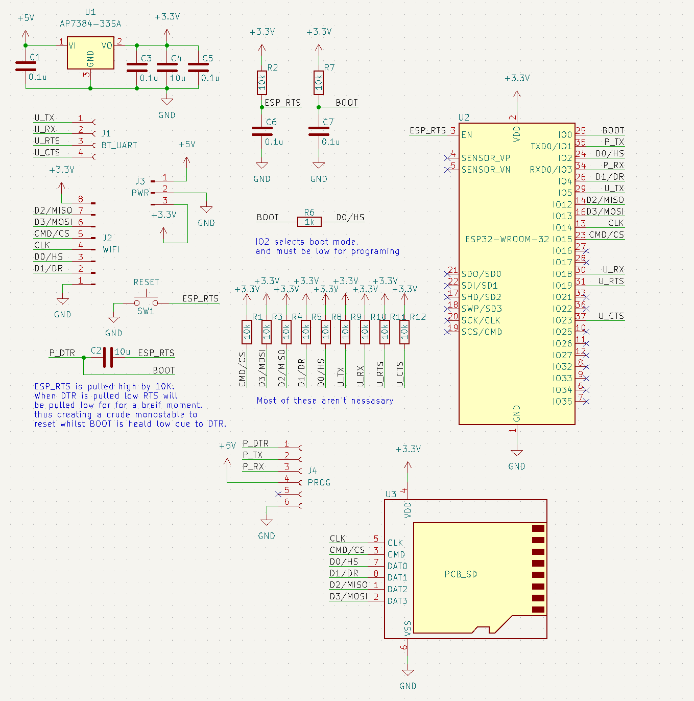
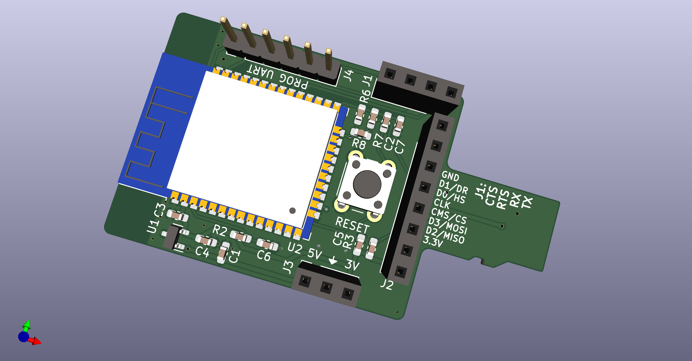
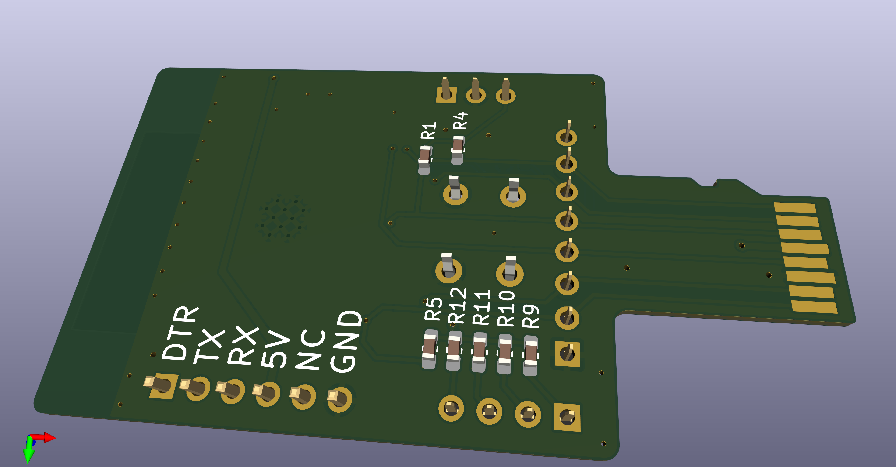

# Test board for esp-hosted-ng

## Esp-hosted-ng is a SDIO/SPI WIFI/BT module for hosts runing Linux

To test ESP-Hosted-ng I designed this board to plug into and SD-card slot for easy testing.

The mothod I used before has some major signal integrity loss due to the jumper wires I used.

